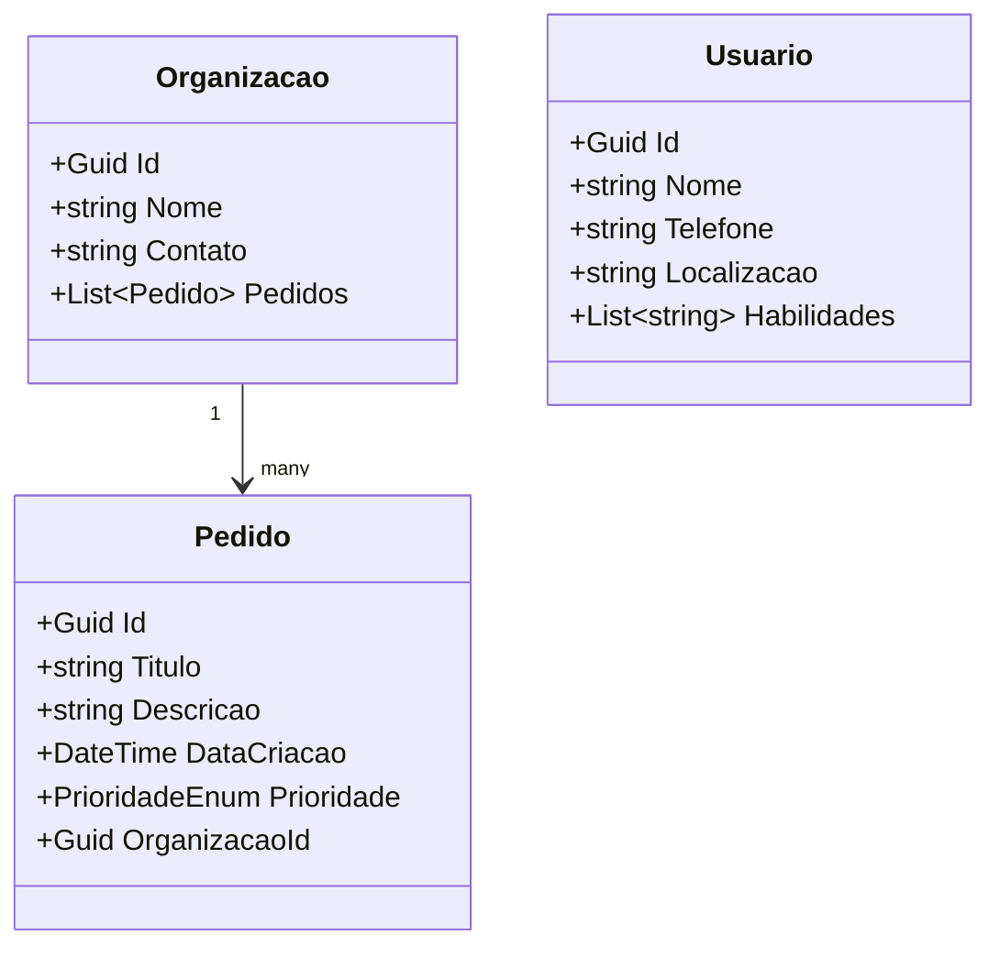

# 🌐 ConectaVoluntário Express - API REST

API REST desenvolvida em .NET 9 com Oracle para conectar voluntários a demandas emergenciais registradas por **organizações** em situações críticas como desastres naturais, crises ambientais ou emergências comunitárias.

> Projeto acadêmico da disciplina **Advanced Business Development with .NET**

---

## 🎯 Objetivo

Criar uma **solução inovadora** que facilite o registro de pedidos de ajuda por **organizações**, permitindo a atuação mais ágil e eficiente da sociedade em momentos críticos. Os **voluntários** são cadastrados apenas como possíveis perfis para ações futuras — sem relação direta com pedidos.

---

## ✅ Requisitos Atendidos

- [x] API REST estruturada com boas práticas de arquitetura (Models, Services, Repositories, Controllers)
- [x] Persistência com **Oracle DB** usando **EF Core**
- [x] Relacionamento **1:N** → `Organizacao` → `Pedido`
- [x] Uso correto de **Migrations**
- [x] Documentação com **Swagger**
- [x] Projeto hospedado no GitHub com instruções completas e testes

---

## 🗂️ Estrutura de Pastas

```
univol-server/
│
├── Controllers/         # Endpoints da API
├── Models/              # Entidades (Organizacao, Pedido, Voluntario)
├── Services/            # Lógica de negócio
├── Data/                # DbContext + FluentAPI
├── Migrations/          # Histórico de banco
├── appsettings.json     # Configuração do Oracle
└── Program.cs           # Bootstrap da aplicação
```

---

## 🧭 Diagrama de Entidades



---

## 🧪 Exemplos de Requisições

### Criar Organização

```http
POST /api/organizacoes
Content-Type: application/json

{
  "nome": "Defesa Civil",
  "contato": "contato@defesacivil.gov"
}
```

### Criar Pedido (por Organização)

```http
POST /api/pedido
Content-Type: application/json

{
  "titulo": "Distribuição de água",
  "descricao": "Precisamos distribuir água em área alagada",
  "prioridade": "Alta",
  "DataCriacao": "2023-10-05"
  "organizacaoId": "ID_DA_ORGANIZACAO"
}
```

### Criar Voluntário

```http
POST /api/usuario
Content-Type: application/json

{
  "nome": "Rafael Macoto",
  "telefone": "rafael@example.com",
  "Localizacao": "SP",
  "habilidades": ["Logística", "Primeiros Socorros"]
}
```

---

## ⚙️ Como Rodar o Projeto

### 1. Clone o repositório

```bash
git clone https://github.com/seuusuario/univol-server.git
cd univol-server
```

### 2. Configure a string de conexão no `appsettings.json`

```json
"ConnectionStrings": {
  "UniVolConnection": "User Id=SEU_USUARIO;Password=SUA_SENHA;Data Source=SEU_SERVIDOR"
}
```

### 3. Execute as migrations

```bash
dotnet ef database update
```

### 4. Rode a aplicação

```bash
dotnet run
```

### 5. Acesse o Swagger

```
https://localhost:5001/swagger
```

---

## 🧪 Testes e Validações

- Testes manuais realizados via Swagger
- Verificação de:
  - Criação de entidades
  - Relacionamentos funcionando
- Validação de regras como:
  - Campos obrigatórios
  - Tipagem dos dados
  - Relacionamento entre `Pedido` e `Organizacao`

---

## 📘 Documentação

Disponível automaticamente em:

```
https://localhost:5001/swagger
```


## 👥 Autores

- Rafael Macoto  
- Gabrielly Macedo
- Fernando Aguiar

---
